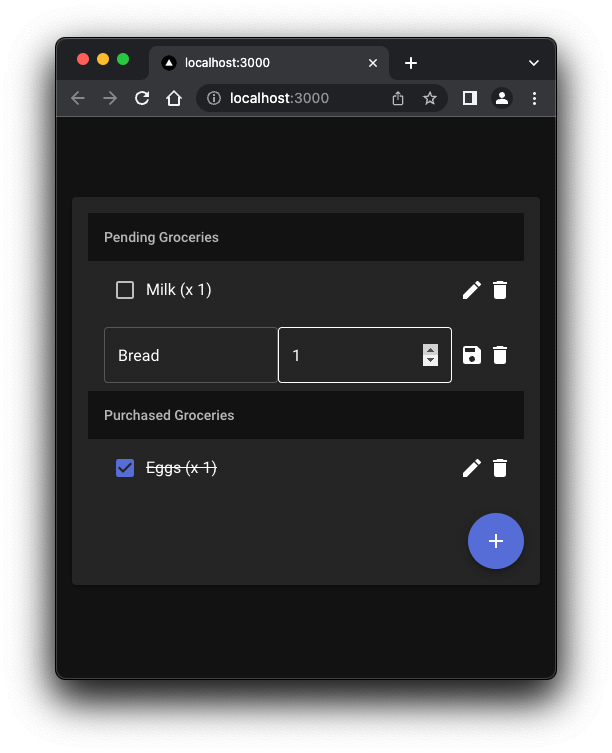

# Grocery list NextJS Experiment

[](https://github.com/vviikk/nextjs-research/actions/workflows/playwright.yml)

![Open in CodeSandbox](https://codesandbox.io/p/github/vviikk/nextjs-research/main?layout=%257B%2522sidebarPanel%2522%253A%2522EXPLORER%2522%252C%2522rootPanelGroup%2522%253A%257B%2522direction%2522%253A%2522horizontal%2522%252C%2522type%2522%253A%2522PANEL_GROUP%2522%252C%2522id%2522%253A%2522ROOT_LAYOUT%2522%252C%2522panels%2522%253A%255B%257B%2522type%2522%253A%2522PANEL_GROUP%2522%252C%2522direction%2522%253A%2522horizontal%2522%252C%2522id%2522%253A%2522EDITOR%2522%252C%2522panels%2522%253A%255B%257B%2522type%2522%253A%2522PANEL%2522%252C%2522panelType%2522%253A%2522TABS%2522%252C%2522id%2522%253A%2522cljpvdg04000b3b6mg9bwbdq2%2522%257D%255D%252C%2522sizes%2522%253A%255B100%255D%257D%252C%257B%2522type%2522%253A%2522PANEL_GROUP%2522%252C%2522direction%2522%253A%2522horizontal%2522%252C%2522id%2522%253A%2522DEVTOOLS%2522%252C%2522panels%2522%253A%255B%257B%2522type%2522%253A%2522PANEL%2522%252C%2522panelType%2522%253A%2522TABS%2522%252C%2522id%2522%253A%2522cljpvdg04000d3b6moj90rzmn%2522%257D%255D%252C%2522sizes%2522%253A%255B100%255D%257D%255D%252C%2522sizes%2522%253A%255B39.768672913027366%252C60.231327086972634%255D%257D%252C%2522tabbedPanels%2522%253A%257B%2522cljpvdg04000b3b6mg9bwbdq2%2522%253A%257B%2522id%2522%253A%2522cljpvdg04000b3b6mg9bwbdq2%2522%252C%2522activeTabId%2522%253A%2522cljpvdg04000a3b6mk3epavwn%2522%252C%2522tabs%2522%253A%255B%257B%2522id%2522%253A%2522cljpvdg04000a3b6mk3epavwn%2522%252C%2522mode%2522%253A%2522permanent%2522%252C%2522type%2522%253A%2522FILE%2522%252C%2522filepath%2522%253A%2522%252FREADME.md%2522%252C%2522view%2522%253A%2522code%2522%252C%2522state%2522%253A%2522IDLE%2522%257D%252C%257B%2522type%2522%253A%2522FILE%2522%252C%2522filepath%2522%253A%2522%252F.codesandbox%252Ftasks.json%2522%252C%2522id%2522%253A%2522cljpvhpus01ac3b6mztth7dcl%2522%252C%2522mode%2522%253A%2522permanent%2522%257D%255D%257D%252C%2522cljpvdg04000d3b6moj90rzmn%2522%253A%257B%2522id%2522%253A%2522cljpvdg04000d3b6moj90rzmn%2522%252C%2522activeTabId%2522%253A%2522cljpvgcf000vk3b6m0uypd9ps%2522%252C%2522tabs%2522%253A%255B%257B%2522type%2522%253A%2522TASK_LOG%2522%252C%2522taskId%2522%253A%2522dev%2522%252C%2522id%2522%253A%2522cljpvea8000b23b6mg4b47g8c%2522%252C%2522mode%2522%253A%2522permanent%2522%257D%252C%257B%2522type%2522%253A%2522TASK_PORT%2522%252C%2522taskId%2522%253A%2522dev%2522%252C%2522port%2522%253A3001%252C%2522id%2522%253A%2522cljpvehdp00g93b6mdhvkmc6f%2522%252C%2522mode%2522%253A%2522permanent%2522%252C%2522path%2522%253A%2522%252F%2522%257D%252C%257B%2522type%2522%253A%2522TASK_PORT%2522%252C%2522taskId%2522%253A%2522dev%2522%252C%2522port%2522%253A3000%252C%2522id%2522%253A%2522cljpvehqa00in3b6m4f7w5k1b%2522%252C%2522mode%2522%253A%2522permanent%2522%252C%2522path%2522%253A%2522%252F%2522%257D%252C%257B%2522id%2522%253A%2522cljpvf5iv00kn3b6mbvu07wuo%2522%252C%2522mode%2522%253A%2522permanent%2522%252C%2522type%2522%253A%2522TERMINAL%2522%252C%2522shellId%2522%253A%2522cljpvfcvq001jfogmekmz9hfj%2522%257D%252C%257B%2522id%2522%253A%2522cljpvgcf000vk3b6m0uypd9ps%2522%252C%2522mode%2522%253A%2522permanent%2522%252C%2522type%2522%253A%2522TASK_PORT%2522%252C%2522port%2522%253A3000%252C%2522taskId%2522%253A%2522dev%2522%252C%2522path%2522%253A%2522%252F%2522%257D%255D%257D%257D%252C%2522showDevtools%2522%253Atrue%252C%2522showSidebar%2522%253Atrue%252C%2522sidebarPanelSize%2522%253A15%257D)

# What is this?




```bash
$ npm run dev # starts the dev server

# or
$ npm run build # builds the app
$ npm run start # starts the app
```

An example app allowing users to make their grocery lists.

Here are user stories that should be covered:

- As a user, I can view my grocery list
- As a user, I can add, edit and delete items to my grocery list
- As a user, I can add an amount to each item in the list
- As a user, I can mark an item as bought. This will cross out the title and mark the checkbox as checked.

Tech stack:

- NextJS
- react-query
- MUI
- Node
- Playwright for e2e tests
- Jest for unit tests
- supertest for Nodejs tests
- Github Actions for CI
