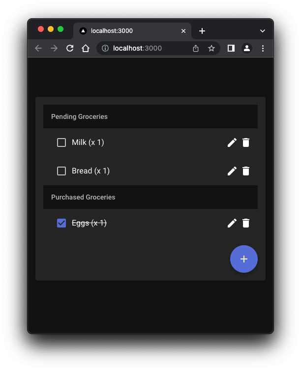

# Grocery list NextJS Experiment

[](https://github.com/vviikk/nextjs-research/actions/workflows/playwright.yml)

[Open in CodeSandbox](https://shorturl.at/ejwQV)

# What is this?




```bash
$ npm run dev # starts the dev server

# or
$ npm run build # builds the app
$ npm run start # starts the app

# running tests
$ npm test # runs jest
$ npm test:e2e # runs end to end tests using playwright
```

An example app allowing users to make their grocery lists.

Here are user stories that should be covered:

- As a user, I can view my grocery list
- As a user, I can add, edit and delete items to my grocery list
- As a user, I can add an amount to each item in the list
- As a user, I can mark an item as bought. This will cross out the title and mark the checkbox as checked.

Tech stack:

- NextJS
- react-query
- MUI
- Node
- prettier & prettier-eslint for codestyle
- Github Actions for CI
- Playwright for e2e tests, running on CI
- Jest for unit tests, running on CI
- supertest for Nodejs tests
